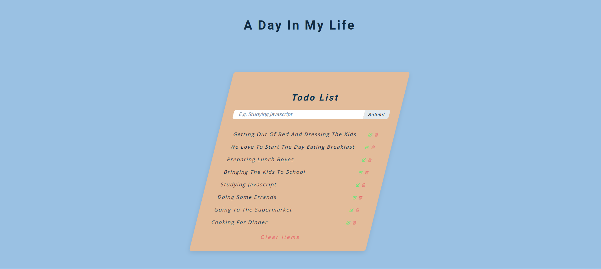

# Todo List

> The Todo list page aims to provide users with a simple yet effective tool for
> managing their tasks efficiently. By implementing CRUD operations and
> additional features, the page will enhance productivity and organization for
> individuals and or a team.

## Table of contents

- [Todo List](#todo-list)
  - [Table of contents](#table-of-contents)
  - [General info](#general-info)
  - [Screenshots](#screenshots)
  - [Technologies](#technologies)
  - [Setup](#setup)
  - [Code Examples](#code-examples)
  - [Features](#features)
  - [Status](#status)

## General info

> The objective of the project is to practice Separation of Concern in
> JavaScript and to be able to implement the CRUD operation.

## Screenshots



## Technologies

- JavaScript
- HTML5
- CSS3
- VSC code
- Jest

## Setup

Create a new repo from the template

1. Clone the repo from your GitHub account
   > git clone `HTTPS link`
2. Open Visual Studio Code
3. Run npm i
4. Open index.html

## Code Examples

```js
const data = {
	items: [
		{
			id: 1,
			text: 'Getting out of bed and dressing the kids',
		},
		{
			id: 2,
			text: 'We love to start the day eating breakfast',
		},
	],
};
```

## Features

Create (Add a Task): Users should be able to input a task and add it to the
list. This typically involves a form where users can enter the task description
and submit it.

Read (View Tasks): Display the list of tasks to the user. Each task should be
shown with options for editing or deleting.

Update (Edit a Task): Users should be able to edit existing tasks. Clicking on
an "edit" button or double-clicking on the task could turn it into an editable
field. After editing, users should be able to save the changes.

Delete (Remove a Task): Users should be able to delete tasks from the list. This
can be done by clicking on a "delete" button next to each task.

To-do list:

- Start by defining the HTML structure for the todo list.
- Style the page using CSS.
- Separating concerns in this way, to have a clear structure, making code easier
  to understand, maintain, and expand upon. It's a great approach for building
  scalable and maintainable page

## Status

Project is: completed
